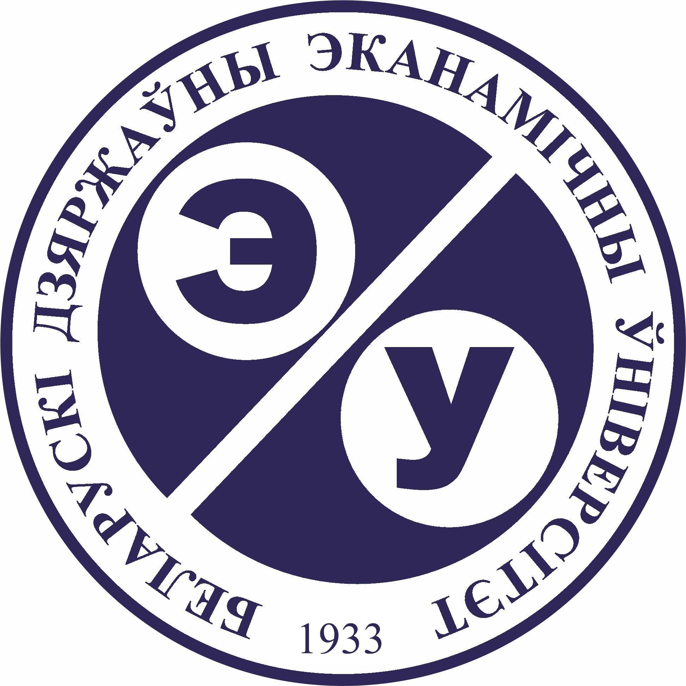

## Hello, World! :earth_americas:

<!--
**Yuliya1303/Yuliya1303** is a ✨ _special_ ✨ repository because its `README.md` (this file) appears on your GitHub profile.

Here are some ideas to get you started:

- 🔭 I’m currently working on ...
- 🌱 I’m currently learning ...
- 👯 I’m looking to collaborate on ...
- 🤔 I’m looking for help with ...
- 💬 Ask me about ...
- 📫 How to reach me: ...
- 😄 Pronouns: ...
- ⚡ Fun fact: ...
-->

My name is Yuliya. I,m **QA Engineer** during 8 years.

#### Languages 
- Russian (native)
- English (B2)
- Poland (A2)

### My education experience
<table width="100%" border='0'>
   <tr> 
    <td width="10%" valign="bottom"></td><td valign="middle"><a target="_blank" href="http://bseu.by/english/">Belarusian State Economic University</a> (2010 - 2014) Department of accounting, analysis and audit in Trade</td></tr>
    <tr><td width="10%" valign="bottom"></td><td valign="middle"> <a target="_blank" href="https://www.it-courses.by/">Stormnet</a>  (2016) Course "Quality Assurance"</td>
    <tr><td width="10%" valign="bottom"></td><td valign="middle"> <a target="_blank" href="https://qa.guru">qa.guru</a> (2022)
	 Course "Automation QA Engineer (Java)"</td></tr>
   </tr>
  </table>
   
 
 
